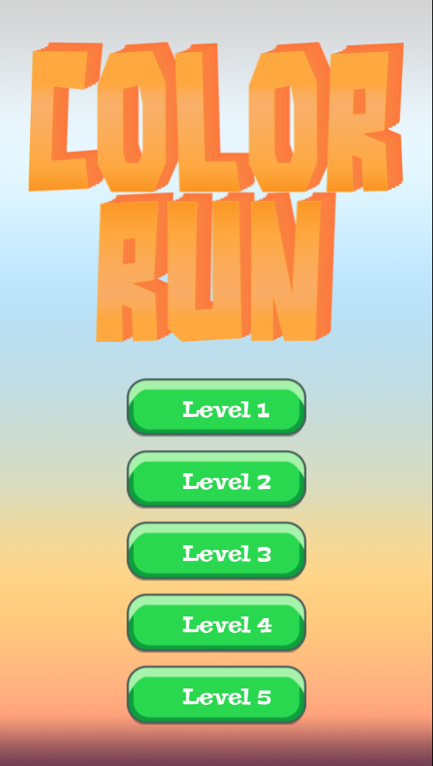
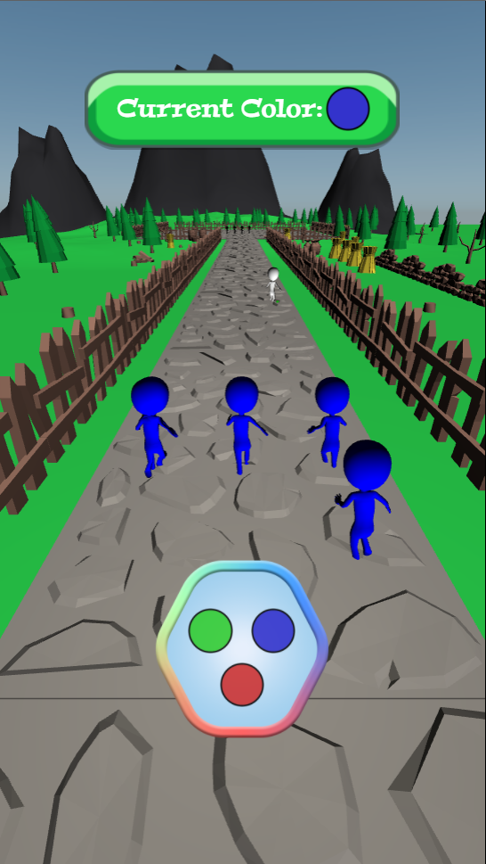
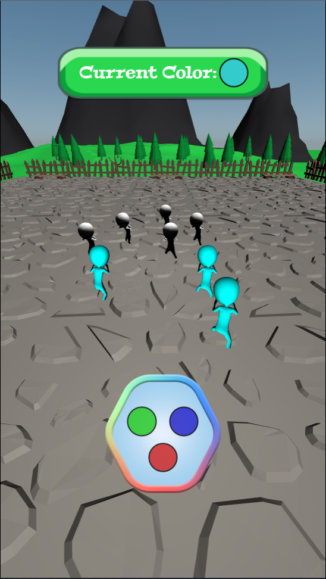

# ColorRun #

## Internship 2021 Web Team 1.2 ##

This is the ColorRun game implementation made during the internship at IndieGameDev Club & Innopolis University.

A W4 game (created and maintained by Anton Dospekhov).

Game is written in W4Web Engine using C++ and targeted for Web platform.

The gameplay idea was based on [mobile game](https://play.google.com/store/apps/details?id=com.freeplay.runandfight).

## Screenshots: ##

